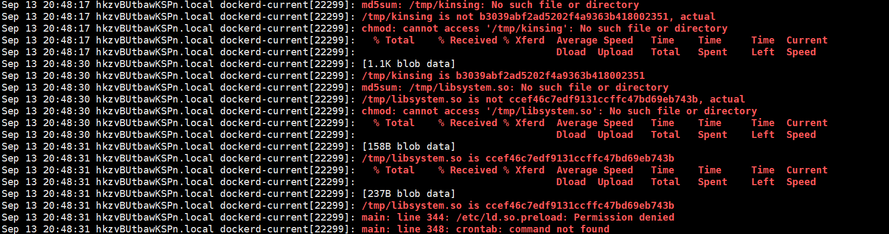

# 0914服务器查杀

## 起因和症状

登录服务器时发现CPU占用率异常，执行top命令查看发现名为`kdevtmpfsi`的可疑进程，搜索后发现为挖矿病毒


## 初步检查

首先查出`kdevtmpfsi`的进程号直接kill,但是过一段时间后会发现进程再次运行，怀疑存在定时任务或服务。

## 查杀

### 定位进程位置

通过 find 搜索关键词，发现存在二进制文件，同级目录下还存在名为`kinsing`的可疑二进制文件

```
find / -name "kdevtmpfsi"
```

### 清除可疑文件

记录二进制文件的修改时间，删除所有含关键词可疑文件，检查定时任务下可疑木马程序

## 溯源

### 查看系统日志

检查云服务商CPU使用情况记录，发现4.30分后CPU异常使用，查看Linux日志，筛选相应时间段。


发现可疑计划任务


检查可疑二进制文件的生成时间，发现如下可疑登录和连接


对于关键词`postgres`怀疑数据库遭到入侵，数据库用户正好的之前部署的弱密码


推测数据库遭到爆破，SQL注入入侵



挖矿木马文件被注入


木马已经注入

### 查看docker日志


数据库确实执行过非法SQL文件，可惜没开数据库日志，没办法看到完整的SQL，下次钓鱼看看。

### 总结

由于数据库弱密码被脚本扫描到，爆破后通过SQL借助数据库的特权容器注入挖矿木马。

## 分析

### 中毒原因

1. 默认端口未修改，特征过于明显
2. 弱密码，常用用户名，爆破高危
3. 数据库检查和权限不当
4. docker特权容器风险

### 修改

1. 更换docker映射的端口
2. 修改数据库密码
3. 防火墙设置白名单
